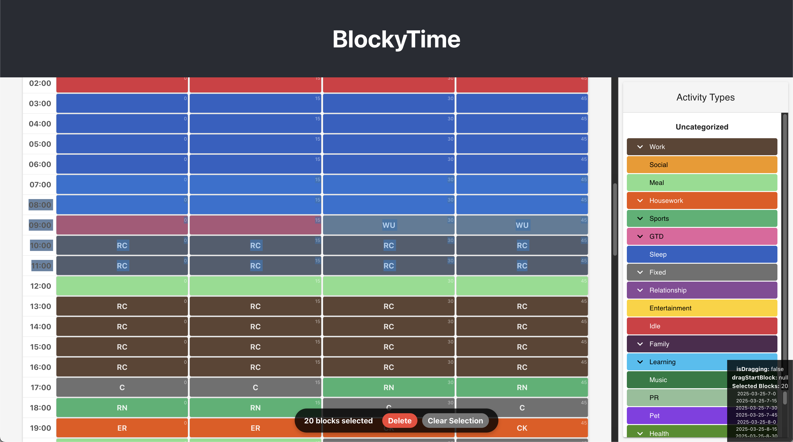

# Web UI for BlockyTime

## Background

[BlockyTime](https://apps.apple.com/us/app/blockytime/id1086617993) is a pixelized time logger, developed by [@anniApp](https://weibo.com/anniApp). See also [another interview](https://indiehacker.im/zuo-zi-ji-chan-pin-de-shen-du-yong-hu-zhuan-fang).

BlockyTime Web UI is a web application written in Python and TypeScript that allows you to view and edit the time blocks of the SQLite3 database generated and managed by the said app.

Note: This is NOT an official product of BlockyTime! BlockyTime also has a desktop app for MacOS, if you are using M1 chip or above.
Consider using this web UI only when you are using Intel Mac, or Linux / Windows.

 
## How to Run

This project is tested only on MacOS with Python 3.10 and Node.js v23.4.0. Node.js is required for building the TypeScript code, but it is not required for running the Python backend.

You would need to connect your iPhone to your Mac, and copy DB.db under `BlockyTime` to `python/blockytime/data/dynamic/DB.db`, and run `make run` and `make fe-dev`.

See the `Makefile` for more details.

## To Dos

1. Editing Types;
2. Editing Projects;
3. (Done) View in 30 minute blocks;
4. (Done) Statistics;
5. Auto convert from other time loggers, like Remember the Milk or 3x3;

